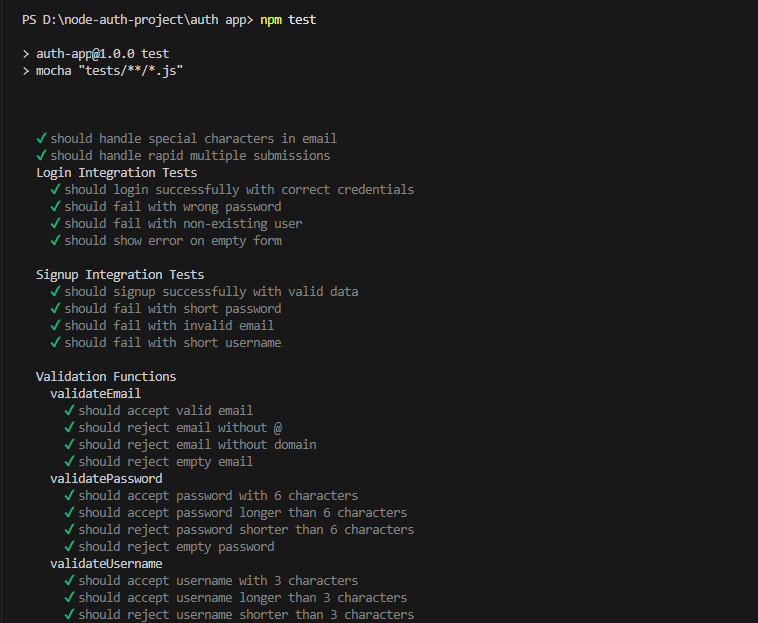
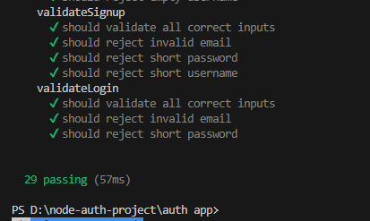
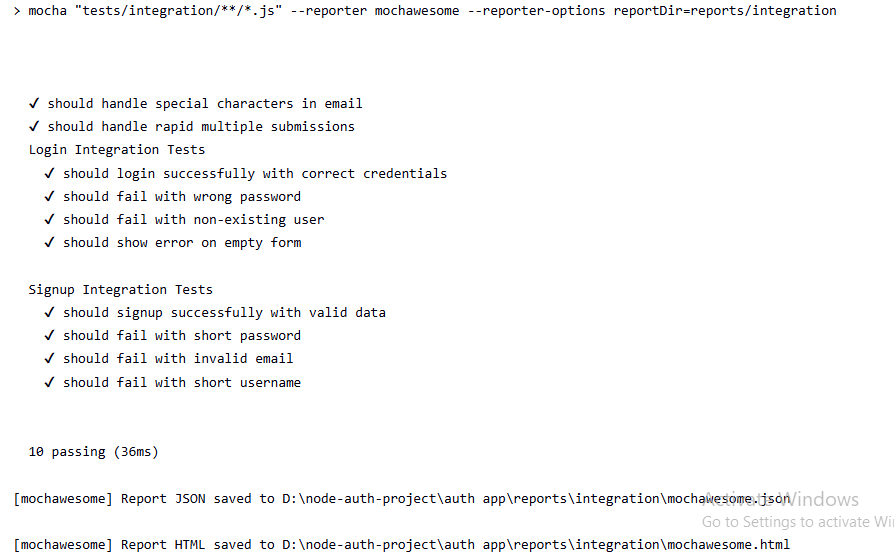
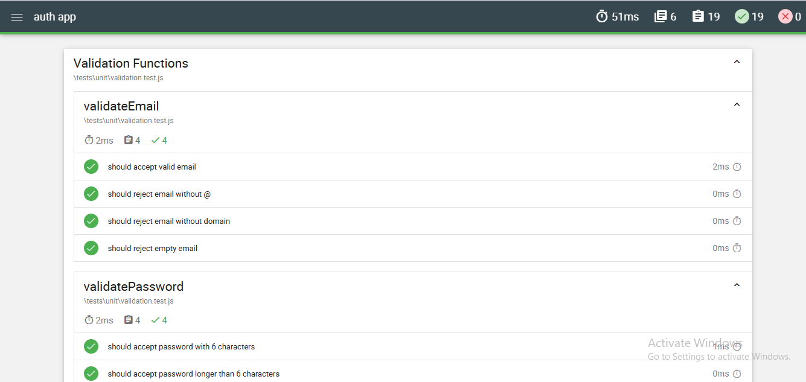
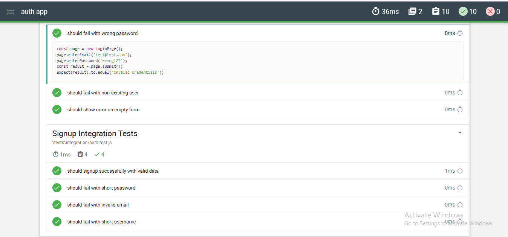

# Node.js Authentication App with Testing & Jenkins Pipeline


---

## 📌 Project Overview

This project is a beginner-friendly **Node.js Authentication System** built using Express.js. It provides basic login and signup functionality with validation logic.

The system does not use a database. Instead, it uses hardcoded credentials for login and validation rules for signup to keep the focus on testing and CI/CD.

### Features:

* Login page (/login)
* Signup page (/signup)
* Input validation (email, password, username)
* Clean modular structure

---

## 🧪 Testing Purpose

Automation testing is implemented to ensure:

* Correct validation of user inputs
* Proper authentication behavior
* Reliability of application features

### Why Automation?

* Detect errors early
* Ensure consistent functionality
* Improve software quality
* Enable CI/CD integration with Jenkins

---

## ⚙️ Tech Stack

* **Node.js** – Backend runtime
* **Express.js** – Web framework
* **Mocha** – Test framework
* **Chai** – Assertion library
* **Jenkins** – CI/CD automation tool
* **Mochawesome** – Test report generator

---

## 📊 Test Summary

| Type              | Count | Status |
| ----------------- | ----- | ------ |
| Unit Tests        | 19    | Pass ✅ |
| Integration Tests | 10    | Pass ✅ |
| **Total**         | 29    | Pass ✅ |

---

## 🔄 Jenkins Pipeline Explanation

The Jenkins pipeline automates the testing process using the following stages:

### 1. Install Dependencies

* Runs `npm install`
* Installs all required packages

### 2. Run Unit Tests

* Executes validation tests
* Command: `npm run test:unit`

### 3. Run Integration Tests

* Tests login and signup flows
* Command: `npm run test:integration`

### 4. Generate Reports

* Generates HTML reports using Mochawesome
* Publishes reports using Jenkins HTML Publisher Plugin

---

## 📁 Project Structure

```
auth-app/
│
├── app.js
├── routes/
├── views/
├── public/
├── utils/
│   └── validation.js
│
├── tests/
│   ├── unit/
│   ├── integration/
│   ├── pages/
│
├── reports/
├── package.json
```

---

## 🚀 How to Run the Project

```bash
npm install
npm start
```

Open in browser:

```
http://localhost:3000/login
http://localhost:3000/signup
```

---

## 🧪 How to Run Tests

```bash
npm test
npm run test:unit
npm run test:integration
```

---

## 📸 Required Screenshots

### ✅ Local Test Results



---

### ✅ Jenkins Successful Build


---

### ✅ Jenkins HTML Reports

#### 🔹 Unit Test Report


#### 🔹 Integration Test Report


---

## 📦 Submission Details

* 🎥 Video Demonstration: https://drive.google.com/file/d/15ho9U40l1fb9lHE3bojZWL1c_uqvYpnx/view?usp=sharing
* 💻 GitHub Repository: https://github.com/Hassan-Zulfiqar/node-auth-app

---

## 👤 Author Information

* **Name:** Muhammad Abu Ul Hassan
* **Roll No:** 22F-3253
* **Course:** Software Testing
* **Submission Date:** April 17, 2026

---

## ✅ Conclusion

This project demonstrates:

* Authentication system implementation
* Unit & Integration testing
* Page Object Model (POM)
* CI/CD pipeline using Jenkins
* Automated report generation

---
